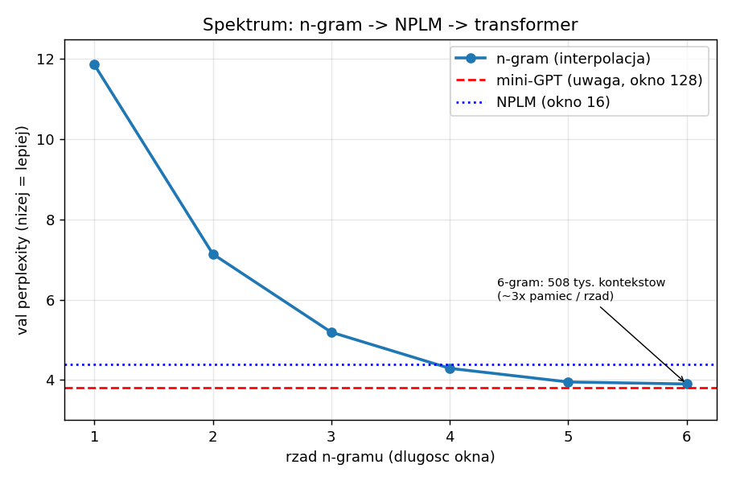

# Dlaczego 6-gram prawie dorównuje transformerowi — i czemu to *nie* znaczy, że wygrywa

*Studium na mikro-skali: jeden cel, trzy mechanizmy, trójkąt **jakość – pamięć – obliczenia**.*

> **Status:** DRAFT do recenzji. Wszystkie liczby z naszych biegów (char-level, CPU), kod i wagi otwarte.

## TL;DR
Na char-level korpusie muzyki **n-gram rzędu 6 osiąga perplexity 3,90 — niemal jak nasz mini-transformer (3,80).** Brzmi jak „to po co komu transformery?". Odpowiedź: bo perplexity to tylko **jeden z trzech zasobów**. Gdy dołożymy **pamięć** i **obliczenia**, n-gram i transformer okazują się **przeciwnymi rogami** tego samego trójkąta — a różnicą, której perplexity nie widzi, jest **generalizacja**.

## Jeden cel, spektrum mechanizmów
Każdy model języka robi to samo: przewiduje następny token, `p(następny | poprzednie)`. n-gram i transformer to nie „stary" i „nowy" model — to dwa **mechanizmy** realizujące ten sam cel: **twarde zliczanie** vs **miękka uwaga**. Między nimi leży ciągłe spektrum.

Żeby zobaczyć je naprawdę, zeszliśmy na najmniejszy, w pełni audytowalny koniec: **poziom znaku**, korpus melodii (jigi w notacji ABC), modele trenowane w minuty na CPU. Wszystko na **jednym** podziale train/val, więc perplexity (= jak bardzo model jest zaskoczony prawdziwym następnym znakiem; niżej = lepiej) jest bezpośrednio porównywalne.

## Trzej zawodnicy
- **n-gram** — zlicza, ile razy po danym oknie *k* znaków padł znak *x*, i czyta prawdopodobieństwo z tablicy. Używamy **interpolacji rzędów** (mieszamy 1…6-gram z wagami, z gładkim backoffem do krótszych okien).
- **NPLM** (Bengio i in., 2003) — „neuronowy n-gram": mały MLP nad embeddingami *N* ostatnich znaków. Stałe okno jak n-gram, ale **uczy się reprezentacji, nie tablicy**.
- **mini-GPT** — transformer z uwagą: sam waży, które wcześniejsze znaki są istotne; **zmienny, długi kontekst**.

<details>
<summary>Jak interpolujemy n-gram (rozwiń)</summary>

Dla danego kontekstu liczymy ważoną średnią oszacowań z każdego rzędu, renormalizowaną po rzędach, których kontekst **był** w treningu:

```
              Σ w_o · p_o(znak | ostatnie o znaków)
P(znak|ctx) = ────────────────────────────────────     w_o = 2^o
              Σ w_o        (po rzędach aktywnych)
```
Najdłuższy widziany kontekst dominuje (duża waga), a gdy go brak — wypada i zjeżdżamy na krótszy (backoff). Rząd 0 (unigram, add-k) jest zawsze aktywny, więc żaden znak nie dostaje prawdopodobieństwa zero. To prosty, jawny schemat — nie Kneser-Ney; wagi nie są uczone.
</details>

## Wynik 1: perplexity — i niespodzianka



| Model | mechanizm | val ppl |
|---|---|---|
| n-gram rząd 1 | zliczanie, okno 1 | 11,86 |
| n-gram rząd 3 | zliczanie, okno 3 | 5,19 |
| n-gram rząd 6 | zliczanie, okno 6 | **3,90** |
| NPLM, okno 8 | MLP, stałe okno | 4,41 |
| NPLM, okno 16 | MLP, stałe okno | 4,38 |
| **mini-GPT** | uwaga, okno 128 | **3,80** |

n-gram poprawia się z rzędem (11,86 → 3,90) i **dobija do GPT** przy rzędzie 5–6. Na samym perplexity to prawie remis. Koniec historii? Nie — to dopiero początek.

## Wynik 2: trzy zasoby, nie jedna liczba

### Pamięć
| Model | co przechowuje |
|---|---|
| n-gram rząd 6 | **508 tys. kontekstów** (rośnie ~2–3× na każdy rząd) |
| NPLM, okno 8 | ~41 tys. parametrów |
| mini-GPT | ~800 tys. parametrów |

n-gram kupuje jakość **pamięcią rosnącą lawinowo**: z 52 kontekstów (rząd 1) do 508 tys. (rząd 6), przy malejącym zysku (z rzędu 5 na 6 ppl spada ledwie 3,95 → 3,90).

### Obliczenia — ile FLOPs na jeden token
Transformer (4 warstwy, d=128, kontekst 128), dominujące mnożenia macierzowe na warstwę:
```
QKV proj  3·d·d = 49 152      atencja  2·d·T = 32 768
out proj    d·d = 16 384      MLP      8·d·d = 131 072
≈ 229K MAC / warstwa  ×4 + głowica ≈ 0,92M MAC ≈ ~1,8M FLOPs / token
```
| Model | obliczenia / token |
|---|---|
| n-gram ≤6 | ~7 odczytów z tablicy + ~20 operacji (arytmetyka ≈ 0) |
| NPLM, okno 8 | ~79 tys. FLOPs |
| mini-GPT | **~1,8 mln FLOPs** (rośnie z długością kontekstu) |

Transformer robi **~23× więcej** arytmetyki niż NPLM i **~90 000× więcej** niż n-gram. (Trening: n-gram „uczy się" jednym przebiegiem zliczania; transformer potrzebuje tysięcy kroków gradientu.) **Compute jest niemal odwrotnością pamięci.**

### Generalizacja
n-gram **nie ekstrapoluje**: dla kontekstu niewidzianego w treningu cofa się do krótszego (backoff), a w skrajności do unigramu. **Rekombinuje widziane, nie tworzy nic dla nowego wzorca.** Modele neuronowe ekstrapolują — podobny kontekst (w przestrzeni embeddingów) dostaje sensowną predykcję, nawet jeśli dokładnie tego ciągu nie widziały.

## Trójkąt
To nie jest „kto ma niższy ppl". To **trójkąt: jakość (ppl) ⟷ pamięć ⟷ obliczenia**, a w tle **generalizacja**:
- **n-gram** — tani w obliczeniach, **drogi w pamięci**, zero generalizacji (look-up).
- **transformer** — **drogi w obliczeniach**, zwarty w pamięci, generalizuje.
- **NPLM** — most: tani i zwarty, ale ograniczony stałym oknem.

n-gram i transformer to **przeciwne rogi** tego samego trójkąta; NPLM pokazuje, że między nimi jest ciągłe, sensowne spektrum.

## Uczciwie: czemu n-gram wygląda aż tak dobrze?
Bo muzyka jest **repetytywna** — wiele 6-gramów z val występuje **dosłownie** w train, więc n-gram „wygrywa pamiętaniem". Perplexity na repetytywnych danych nagradza pamiętanie.

**Czego jeszcze NIE zmierzyliśmy:** czystego testu ekstrapolacji — val złożonego z **całkiem nowych melodii** (nie pocięty ten sam strumień). Przewidujemy, że tam n-gram siądzie (backoff do unigramu), a modele neuronowe utrzymają — i to jest nasz następny eksperyment. Nie udajemy, że to już pokazaliśmy.

## Wnioski
Perplexity to jeden wymiar. Pytanie „n-gram czy transformer?" rozstrzyga się w **trójkącie zasobów + generalizacji**. Najtańszy compute (n-gram) płaci pamięcią i brakiem generalizacji; najlepsza generalizacja (transformer) płaci obliczeniami. Wybór mechanizmu to wybór, który zasób jest tani, a który drogi w Twoim zastosowaniu.

Kod, wagi i pełne notatki badawcze są otwarte: **github.com/slayerlabs/micro-models**. Wszystko odtwarzalne, na CPU.

## Jak pracujemy (Slayer)
Krótko o metodzie: *żadnej tezy bez dowodu*, publikujemy też **wyniki negatywne**, a własne pomiary przepuszczamy przez **adwersarialny audyt** (przy pokrewnym eksperymencie złapaliśmy w ten sposób własny błąd metryki, zanim cokolwiek ogłosiliśmy). Dobre wykresy mają opowiadać *historię badawczą*, nie tylko pokazywać dane.

---
### Źródła
- Y. Bengio i in. *A Neural Probabilistic Language Model.* JMLR 2003.
- A. Vaswani i in. *Attention Is All You Need.* NeurIPS 2017.
- U. Khandelwal i in. *Generalization through Memorization: Nearest Neighbor Language Models.* ICLR 2020.
- J. Liu i in. *Infini-gram: Scaling Unbounded n-gram Language Models to a Trillion Tokens.* COLM 2024.
